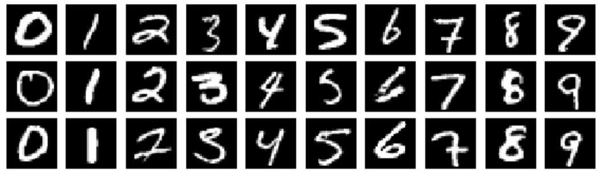
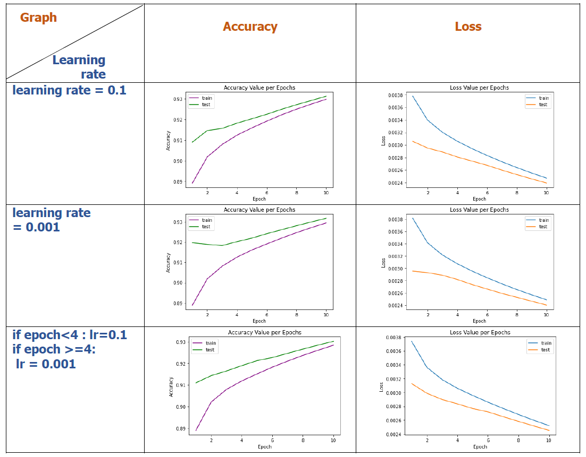

# PyTorch MNIST Classifier: Minimalist Implementation without Built-in Functions

The project involves creating a classifier for the MNIST dataset using PyTorch. The implementation is kept minimalist, relying solely on PyTorch tensor manipulations. The constraints include avoiding the use of auto-differentiation, built-in loss functions, activations, optimization, and layers from torch.nn. The goal is to achieve at least 75% accuracy on the test set with a neural network that includes at least one hidden layer.

## Implementation

The implementation focuses on a neural network designed for the MNIST dataset, featuring two hidden layers. It employs the cross-entropy loss function and utilizes gradient descent for optimization. To improve generalization, the model is trained for 10 epochs, as too few epochs might yield insufficient results. Additionally, a batch size of 100 was chosen to enhance efficiency in the training process.

### The Dataset

MNIST (Modified National Institute of Standards and Technology) is a widely used dataset in the field of machine learning and computer vision. It consists of a collection of 28x28 pixel grayscale images of handwritten digits (0 through 9). The dataset is commonly used for training and testing classification algorithms. MNIST serves as a benchmark for evaluating the performance of various machine learning models, particularly for image recognition tasks.

### Loss Function

The softmax cross-entropy loss function is commonly employed to measure the dissimilarity between the true labels $\(y\)$ and the predicted probabilities $\(\hat{y}\)$ in a classification task. Unlike regular cross-entropy, softmax cross-entropy includes a softmax activation function, which is applied to the model's raw output to obtain probability distributions over the classes. The softmax function ensures that the predicted probabilities sum to 1, making them interpretable as class probabilities.

In PyTorch's `torch.nn` library, the cross-entropy loss is often implemented with softmax. Specifically, the `torch.nn.CrossEntropyLoss` automatically incorporates the softmax function into its computation. This means that when using this loss function, there is no need to explicitly apply a softmax activation to the model's output before calculating the loss.

For each sample in a batch, softmax cross-entropy sums the negative logarithm of the predicted probability assigned to the correct class. The overall loss is then computed as the average across all samples in the batch. This formulation effectively penalizes the model more when its predictions deviate from the true labels, thereby encouraging accurate classification.

The softmax cross-entropy loss formula is given by:

$L(y, \hat {y}) = { -\frac{1}{N} \sum\limits_{i=1}^{N} \sum\limits_{j=1}^{C} y_{i,j} \log(\frac{ e^ {\hat{y_{i,j}}}} {\sum\limits_{k=1}^{C} e^{\hat{y_{i,k}}} }) }$

Where,

- $N {\text{ :The number of elements in the input or the batch size}}$
- $C {\text{ :The number of classes}}$
- $y_{i,j} {\text{ :The true output for the i-th sample and j-th class}}$
- $\hat{y_{i,j}} {\text{ :The predicted output for the i-th sample and j-th class}}$

### Optimization Step

Gradient Descent is an optimization algorithm commonly used in machine learning and deep learning to minimize the cost or loss function during the training of a model. The primary goal is to find the optimal set of parameters (weights and biases) that minimizes the error or loss of the model on the training data.

- $\text{Parameters Initialization: } {\theta^{(0)}}$

- $\text{For } { t = 0, 1, 2, \ldots, \text{until convergence:} }$
  
    $\quad \text{1.Forward Pass: } { h_\theta(x^{(t)})}$

   $\quad \text{2. Compute Loss:} { J(\theta)}$

   $\quad \text{3. Backward Pass (Gradient Calculation):} {\theta^{(t+1)} = \theta^{(t)} - \alpha \nabla J(\theta) } $
  

## Results

Optimizing the learning rate is critical in training a model. A lower learning rate demands more updates for loss minimization, while a higher rate can lead to initial rapid decay, potentially compromising generalization. Hence, I opted for the third option, striking a moderate balance. I utilized a learning rate of 0.1 for the initial three epochs and then transitioned to 0.001. This approach yielded a well-balanced outcome and improved generalization. Notably, the third model exhibited superior learning on the training set, resulting in the highest test accuracy among the three models.

